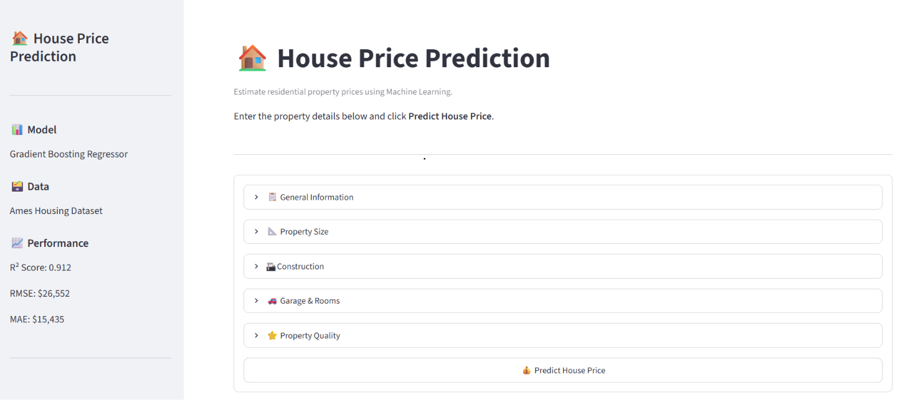
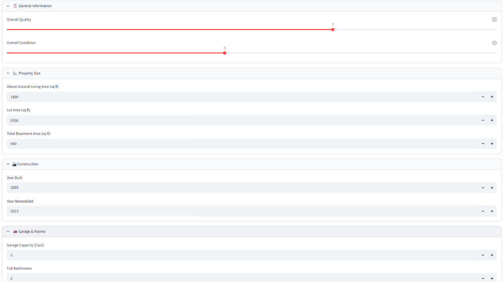
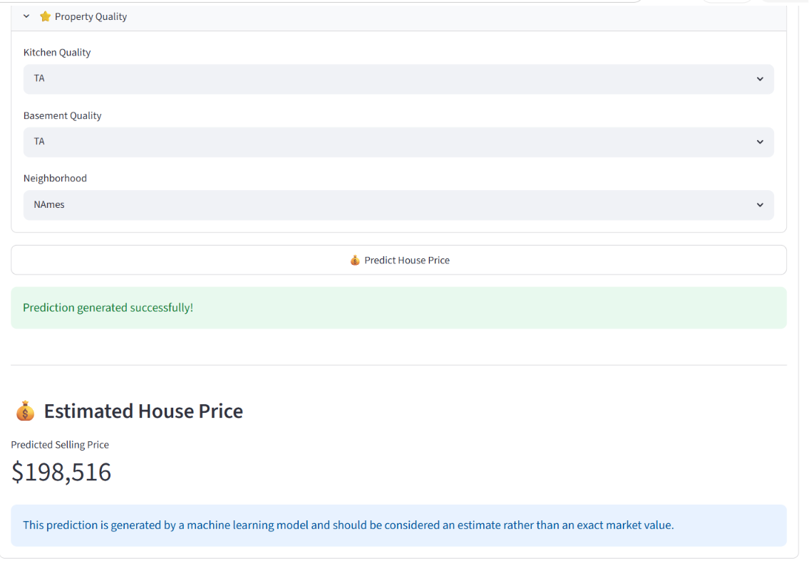
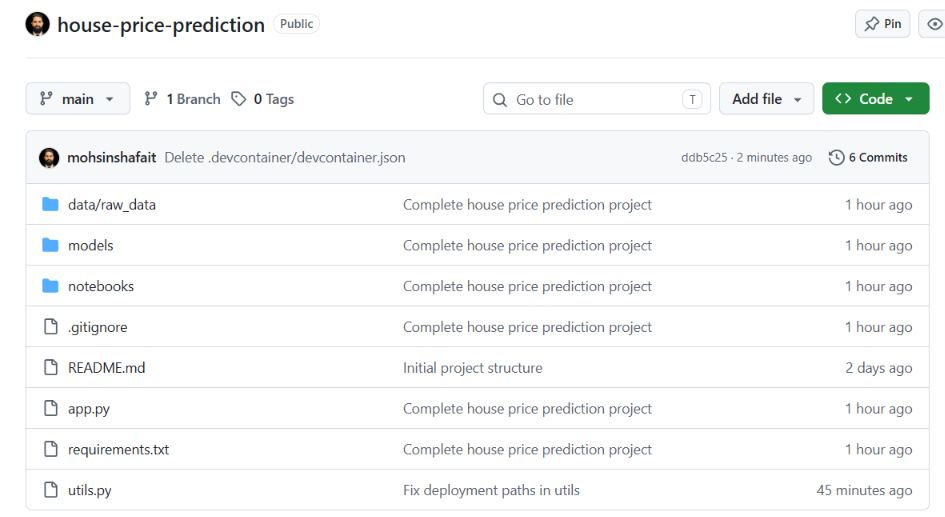

# 🏠 House Price Prediction using Machine Learning


[](https://house-price-prediction-dbul5t5qumu3e6gmvktnyj.streamlit.app/)


Predict residential property prices using Machine Learning based on the Ames Housing dataset. This project demonstrates a complete end-to-end machine learning workflow, from data exploration and preprocessing to model training, deployment, and a user-friendly Streamlit web application.

---

## 🚀 Live Demo

🔗 **Streamlit App:** *https://house-price-prediction-dbul5t5qumu3e6gmvktnyj.streamlit.app/*

🔗 **GitHub Repository:** https://github.com/mohsinshafait/house-price-prediction

---

## 📖 Project Overview

House prices are influenced by many factors such as location, property quality, living area, garage capacity, construction year, and basement size.

The goal of this project is to build a regression model capable of accurately predicting house prices using property features. The final solution is deployed as an interactive Streamlit application where users can enter house details and receive an estimated market price instantly.

---

## 📊 Dataset

**Dataset:** Ames Housing Dataset

- **Rows:** 2,930
- **Features:** 82
- **Target Variable:** `SalePrice`

The Ames Housing dataset is a widely used alternative to the Boston Housing dataset and contains detailed information about residential properties in Ames, Iowa.

---

## 🔍 Exploratory Data Analysis (EDA)

Performed comprehensive data exploration including:

- Missing value analysis
- Duplicate detection
- Numerical feature distributions
- Outlier identification
- Correlation analysis
- Feature importance investigation
- Categorical feature analysis

### Key Findings

- Overall Quality showed the strongest positive correlation with house price.
- Living Area and Garage Capacity were also highly influential.
- Several features contained large percentages of missing values and required customized imputation strategies.
- The target variable (SalePrice) was positively skewed.

---

## 🧹 Data Preprocessing

The preprocessing pipeline includes:

- Missing value imputation
- Median imputation for numerical features
- Most frequent value imputation for categorical features
- One-Hot Encoding of categorical variables
- Automatic preprocessing using Scikit-learn Pipelines

No manual preprocessing is required during prediction because the pipeline handles everything automatically.

---

## 🤖 Models Trained

The following regression models were evaluated:

- Linear Regression
- Decision Tree Regressor
- Random Forest Regressor
- Gradient Boosting Regressor ✅ (Selected)

---

## 📈 Model Performance

| Model | MAE | RMSE | R² Score |
|-------|------:|------:|------:|
| Gradient Boosting | 15,435 | 26,552 | **0.912** |
| Random Forest | 15,697 | 26,715 | 0.911 |
| Linear Regression | 15,666 | 29,106 | 0.894 |
| Decision Tree | 23,763 | 35,819 | 0.840 |

### Selected Model

✅ Gradient Boosting Regressor

Training R²: **0.961**

Testing R²: **0.912**

The close agreement between training and testing scores indicates good generalization with minimal overfitting.

---

## ⭐ Most Important Features

The trained model identified these features as the most influential:

- Overall Quality
- Above Ground Living Area
- Garage Capacity
- Total Basement Area
- Basement Finished Area
- First Floor Area
- Year Built
- Full Bathrooms
- Kitchen Quality
- Basement Quality

---

## 💻 Streamlit Application

The application allows users to:

- Enter property details through an intuitive interface
- Automatically handle missing information
- Predict house prices instantly
- Display model performance metrics
- Use sensible default values for optional fields

---

## 📷 Screenshots

### Home Page



---

### User Input



---

### Prediction Result



---

### GitHub Repository



---

## 📁 Project Structure

```text
house-price-prediction/
│
├── data/
│   └── raw_data/
│       └── AmesHousing.csv
│
├── models/
│   ├── house_price_pipeline.pkl
│   ├── default_values.pkl
│   └── dropdown_options.pkl
│
├── notebooks/
│   ├── 01_data_understanding_and_EDA.ipynb
│   └── 02_preprocessing_model_training.ipynb
│
├── screenshots/
│
├── app.py
├── utils.py
├── requirements.txt
├── README.md
└── .gitignore
```

---

## ⚙️ Technologies Used

- Python
- Pandas
- NumPy
- Scikit-learn
- Joblib
- Streamlit
- Matplotlib
- Git & GitHub

---

## ▶️ Installation

Clone the repository

```bash
git clone https://github.com/mohsinshafait/house-price-prediction.git
```

Move into the project directory

```bash
cd house-price-prediction
```

Install dependencies

```bash
pip install -r requirements.txt
```

Run the application

```bash
streamlit run app.py
```

---

## 💡 Future Improvements

- Advanced feature engineering
- Hyperparameter optimization
- Explainable AI using SHAP values
- FastAPI deployment
- Docker containerization
- CI/CD integration
- Cloud deployment using Azure or AWS

---

## 👨‍💻 Author

**Mohsin Shafait**

AI & Machine Learning Enthusiast

GitHub: https://github.com/mohsinshafait

---

⭐ If you found this project useful, consider giving it a star!